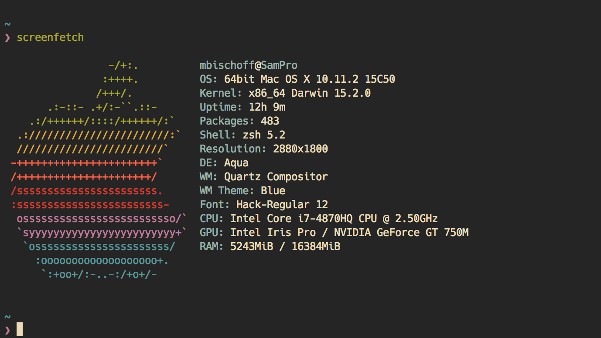

# iTerm 2 Gruvbox Color Scheme

Complements the [gruvbox](https://github.com/morhetz/gruvbox) Vim colorscheme.

## Installation

Just download and import in iTerm.

## Send a Tip my Way

In case you feel particularly generous today, you can buy me a coffee. That would really make my day. Kindness of strangers and all that. If you can't or won't, no hard feelings.

Bitcoin: `1HXi42h9Uk5LmDrq1rVv8ykaFoeARTXw9P`
